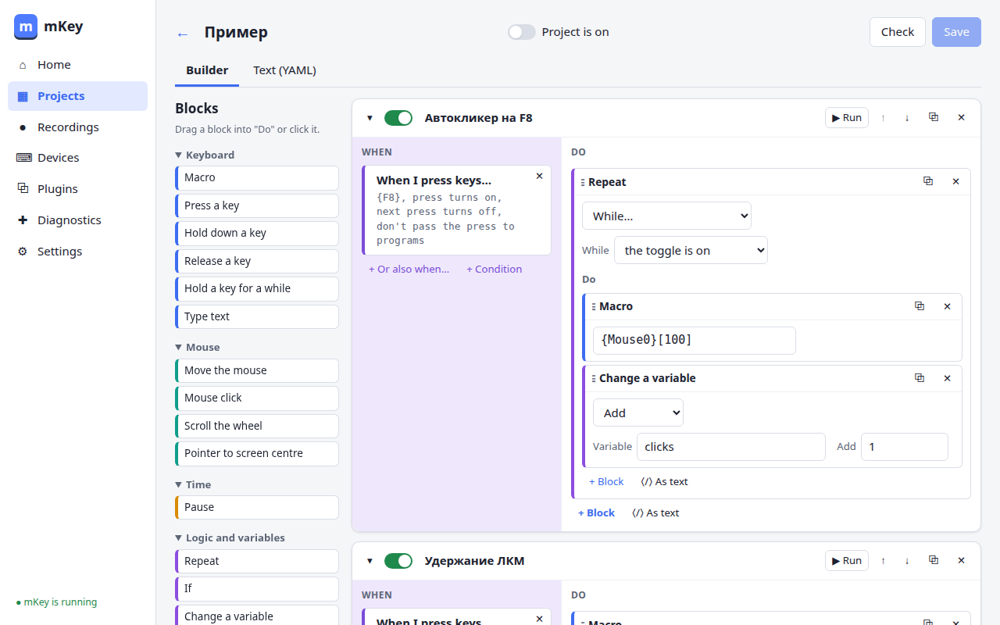
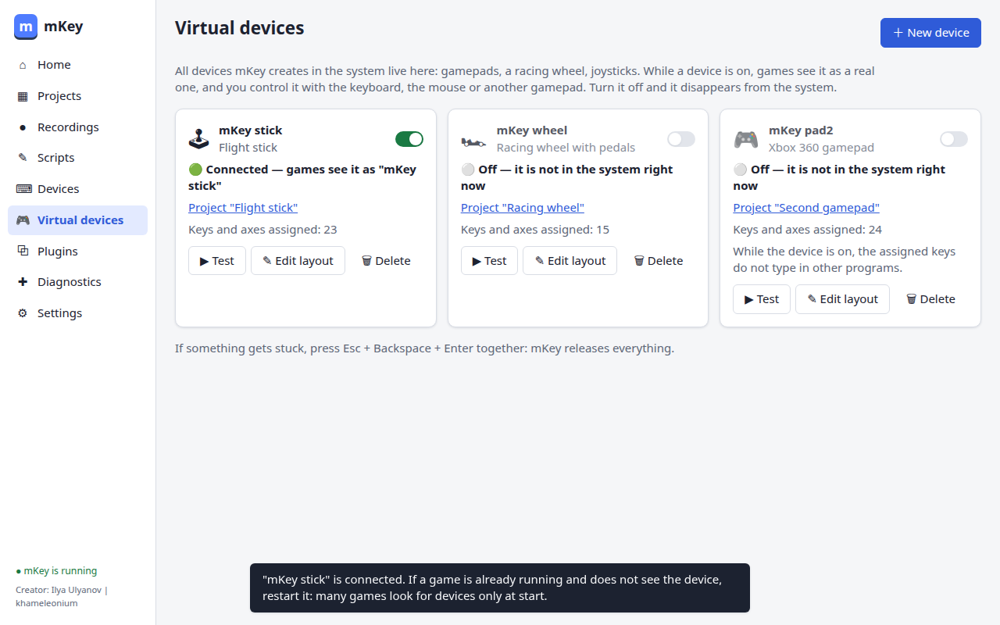
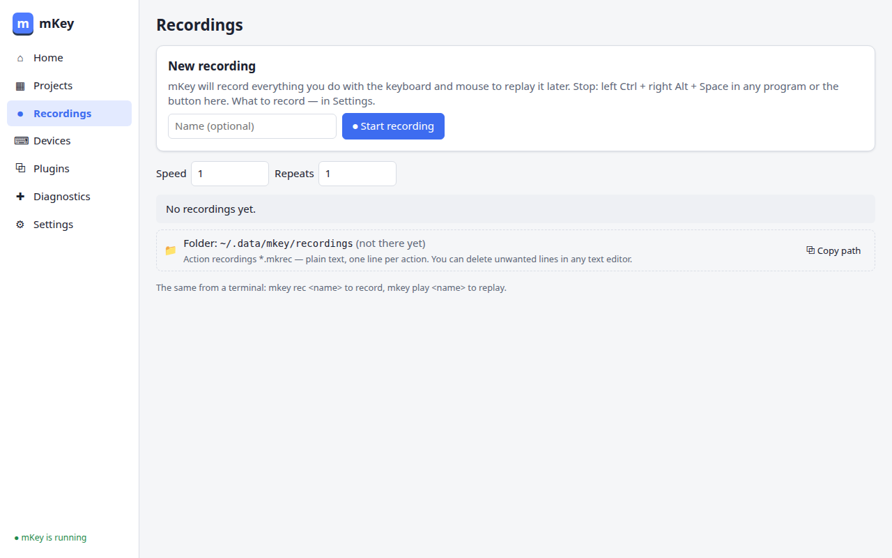
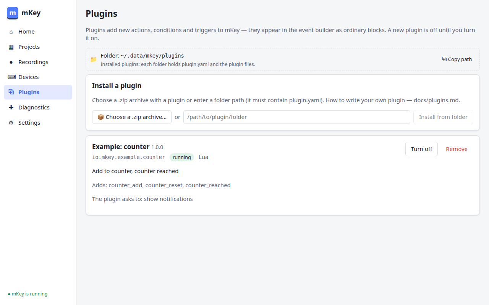

# mKey

**Keyboard and mouse macros for Linux.** · [Русский](README.md)

Creator: Ilya Ulyanov | khameleonium

mKey presses keys and buttons for you: on a hotkey, on a timer, on a typed word or on another
event. It records what you do and replays it. It turns your keyboard and mouse into a gamepad,
a racing wheel or a flight stick that games can see. It works in any Linux graphical session —
X11 and Wayland — because it talks to input devices directly through the kernel.



> Under active development (versions 0.x). Ready: hotkeys and events, the macro language,
> recording and replay, devices, virtual gamepads, a racing wheel and a flight stick, plugins,
> installation and updates.
> The detailed documentation is in Russian.

## Features

- **"When … → do …"**: hotkeys (press, hold, double press, on/off toggle), key sequences, text
  replacement, timers, device connection, manual runs — and actions: key presses, text, mouse,
  pauses, repeats, conditions, variables, Lua and bash scripts.
- **Visual builder** in the app window: drag blocks with the mouse, or write the same as text.
  Ready-made templates: "Autoclicker", "Second gamepad", "Replay a recording", "CapsLock as Esc", text shortcuts…
- **Macro language** with explicit key names: `^{Ctrl}{C}~{Ctrl}` — hold Ctrl, press C, release
  Ctrl; `{"Hello!"}` — type text; `[250]` — wait 250 ms.
- **Recording and replay**: left Ctrl + right Alt + Space in any program starts and stops
  recording; replay from the window, the tray icon menu or a command. A recording is a plain text
  file — delete what you don't need in any editor.
- **Any device**: buttons of unknown gamepads and joysticks get names like `{UnKey001}`; rename
  them (`{Wheel.Gas}`) and bind anything to them.
- **Virtual devices**: Xbox 360 and DualShock 4 gamepads, a **racing wheel with pedals** (games
  recognise it as a wheel), a **flight stick** (stick, throttle, 4 hats, 56 buttons), a joystick,
  a touchscreen — games see them as real ones. Control them with the keyboard, the mouse or another
  gamepad: the mouse turns the wheel and holds the angle, triggers are gas and brake, keys move the
  throttle like a lever.
- **"Virtual devices" page**: every device with its state in plain words ("connected" / "off"),
  one switch to turn it on, the **"New device"** wizard with ready layouts, a **live test** (see
  what the game receives), the layout in the project editor and checkmarks in the tray icon menu.
- **Standalone macro file**: a project is built into one executable that works without an
  installed mKey — on another computer, with a double-click ([details, in Russian](docs/build.md)).
- **Plugins** in any language add new actions and triggers (HTTP request, webhook…).
- **Safety**: **Esc + Backspace + Enter** pressed together stops everything at any moment and
  releases all keys.
- **All settings in one readable file** `~/.config/mkey/config.yaml`, each with an explanation;
  the window edits the same file.

| Virtual devices | Recordings | Plugins |
|---|---|---|
|  |  |  |

## Installation

### Option 1. Download the program (any Linux)

1. Open the [releases page](https://github.com/khameleonium/mKey/releases) and download
   `mkey_<version>_linux_amd64.tar.gz` (regular PC) or `…_arm64.tar.gz` (ARM).
2. Unpack it and run `mkey` by double-clicking it or in a terminal: `./mkey`.
3. A wizard opens. It explains every step and asks for consent: it copies the program to
   `~/.local/bin`, grants access to the keyboard and mouse (the system asks for your password)
   and enables autostart.

### Option 2. A package for your system

The same releases page has packages in four formats: `.deb`, `.rpm`, `.pkg.tar.zst` and `.apk`
(for a regular PC — with `amd64`/`x86_64` in the name, for ARM — with `arm64`/`aarch64`). Download
the format your system understands and install it by double-clicking or with your package manager.
Then start mKey from the application menu: the same wizard sets up device access and autostart —
the package itself changes nothing in the system.

### Option 3. Build it yourself

Requires Go 1.27+ and Node.js 24+:

```bash
git clone https://github.com/khameleonium/mKey.git && cd mKey
make build   # ./mkey — with the window and tray icon; ./mkey-cli — terminal only
./mkey
```

**Authenticity.** Each release has `checksums.txt` (SHA-256) and every file is signed during the
GitHub build. Verify: `gh attestation verify <file> --repo khameleonium/mKey`.

## First steps

1. Open mKey from the application menu (or `mkey gui`) — the window opens in your browser.
2. "Projects" → "From a template" → e.g. "Autoclicker" → turn the project on.
3. Press F8 — mKey starts clicking; press F8 again to stop.
4. Something went wrong — press **Esc + Backspace + Enter** together.

From a terminal:

```bash
mkey send '^{Ctrl}{A}~{Ctrl}'     # select all in the active window
mkey rec game                     # record (stop with left Ctrl + right Alt + Space)
mkey play game --repeat 5         # replay 5 times
mkey doctor                       # check that everything is ready
mkey paths                        # where settings, projects, recordings and the log are
mkey update                       # check for and install a new version
```

## FAQ

**Why does installation need a password?**
To see key presses and to press keys for you, mKey needs access to input devices. A system rule
in `/etc/udev/rules.d/70-mkey.rules` and the `uinput` kernel module grant it — only an
administrator can install them. The password prompt comes from the system; mKey never sees it.
Note: afterwards, programs started as you can read key presses — that is how every program of
this kind works. `mkey uninstall` removes all of it.

**Does it work on Wayland?**
Yes: hotkeys, macros, recording and gamepads work the same on X11 and Wayland. mKey does not watch
program windows or screen pixel colors — events are started by keys, timers, typed words and
devices. Replay first puts the cursor in the screen center, so mouse paths repeat accurately with
any pointer acceleration.

**The keyboard stopped typing / a key got stuck.**
Press **Esc + Backspace + Enter** together: mKey releases all keys, stops macros and stops
capturing the keyboard. Resume with "Resume work" on the home page or `mkey resume`. If input
processing ever hangs, mKey releases the keyboard by itself within half a second.

**Does mKey log what I type? Does it send anything online?**
No. Key presses are never logged, there is no telemetry. mKey goes online only if you turn on
"Check once a day whether a new version is out" or press "Check now" — and only to GitHub.

**How do I update?**
Installed from the archive — Settings → Updates → "Check now", or `mkey update`: mKey downloads
the new version, verifies the checksum, replaces itself and restarts. Installed from a package —
use your package manager. Settings carry over; if their format changes, a copy
`config.yaml.v<N>.bak` is kept.

**Where are my files?**
Settings — `~/.config/mkey/config.yaml`, projects — `~/.config/mkey/projects/`, recordings —
`~/.local/share/mkey/recordings/`, log — `~/.local/state/mkey/mkey.log`. All plain text; the full
list — `mkey paths` or Settings → "Where things are".

**Can I use mKey in online games?**
Technically yes, but the rules and anti-cheat systems of some online games forbid automated and
virtual input, and an account may be banned for it. Read the game's rules: using mKey in it is your
responsibility.

**How do I uninstall?**
Settings → "Uninstall mKey" or `mkey uninstall` (you can keep your projects and settings).
If installed from a package, then also remove the `mkey` package with your package manager.

## License

[MIT](LICENSE). Creator: Ilya Ulyanov | khameleonium
