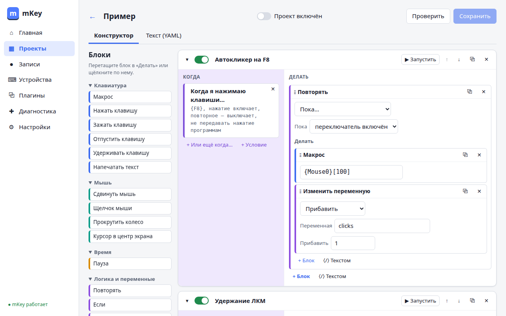
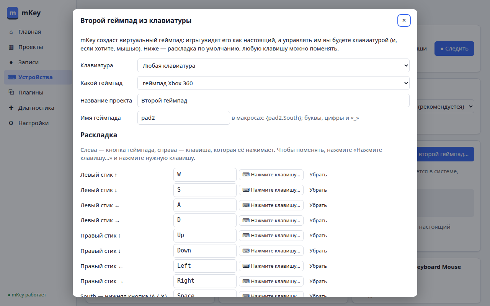
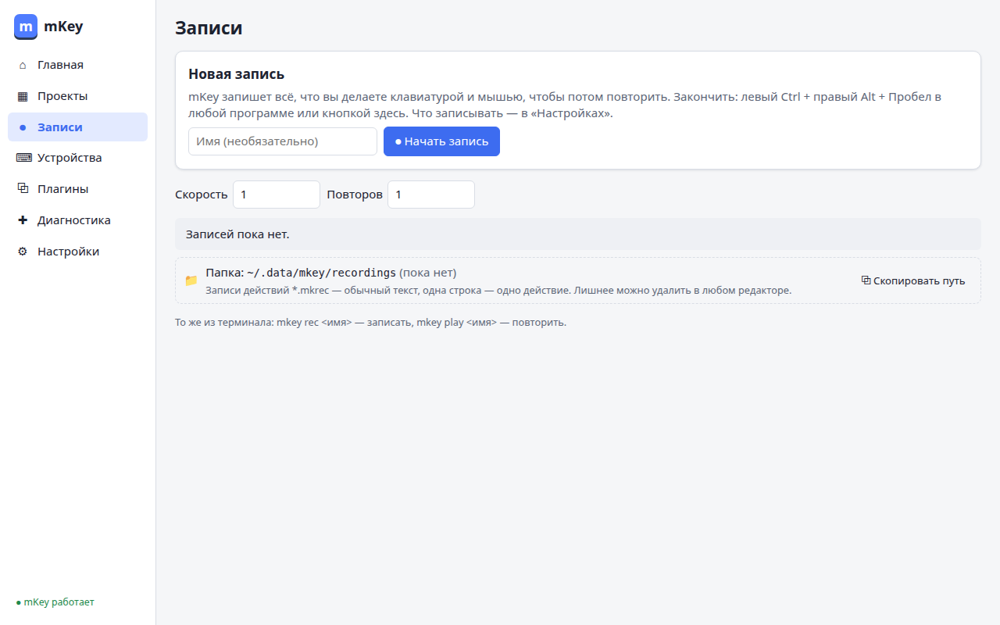
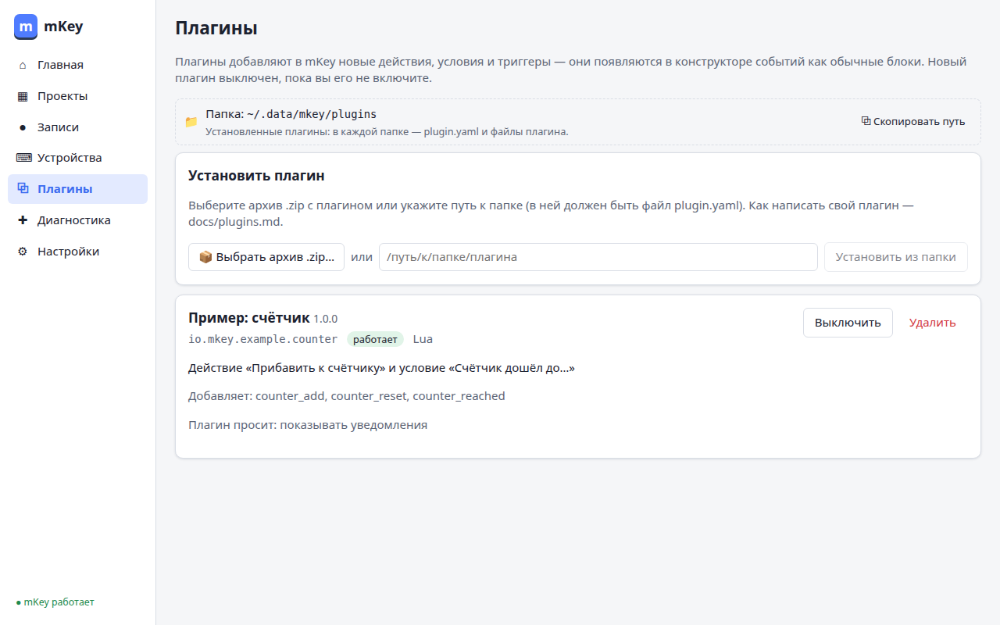

# mKey

**Макросы клавиатуры и мыши для Linux.** · [English](README.en.md)

mKey нажимает клавиши и кнопки за вас: по горячей клавише, по таймеру, по набранному слову или
по другому событию. Записывает ваши действия и повторяет их. Делает из клавиатуры геймпад,
который видят игры. Работает в любой графической среде Linux — и в X11, и в Wayland, — потому что
общается с устройствами ввода напрямую через ядро.



> Проект в активной разработке (версии 0.x). Готово: горячие клавиши и события, язык макросов,
> запись и повтор, устройства и виртуальные геймпады, плагины, установка и обновление.
> Пока не умеет: реагировать на окна программ и цвет точек на экране (этап 8 плана, [SPEC.md](SPEC.md)).

## Что умеет

- **«Когда … → делать …»**: горячие клавиши (нажатие, удержание, двойное нажатие,
  включить/выключить), последовательности клавиш, замена набранных слов, таймер, подключение
  устройства, запуск вручную — и действия: нажатия, текст, мышь, паузы, повторы, условия,
  переменные, скрипты Lua и bash.
- **Конструктор в окне программы**: блоки перетаскиваются мышью; то же можно написать текстом.
  Готовые шаблоны: «Автокликер», «CapsLock как Esc», сокращения текста…
- **Язык макросов** с понятными именами клавиш: `^{Ctrl}{C}~{Ctrl}` — зажать Ctrl, нажать C,
  отпустить Ctrl; `{"Привет!"}` — напечатать текст; `[250]` — пауза 250 мс.
- **Запись и повтор**: левый Ctrl + правый Alt + Пробел в любой программе начинает и заканчивает
  запись; повтор — из окна, меню значка в трее или командой. Запись — обычный текстовый файл,
  лишнее можно удалить в любом редакторе.
- **Любые устройства**: у кнопок незнакомых геймпадов и джойстиков появляются имена вида
  `{UnKey001}`, их можно переименовать (`{Руль.Газ}`) и назначать на них что угодно.
- **Виртуальные геймпады** Xbox 360 и DualShock 4, джойстик, сенсорный экран — игры видят их как
  настоящие. Привязки: клавиша → кнопка или стик, мышь → стик, стик → стик (мёртвая зона,
  чувствительность), курок → клавиша. Мастер **«Второй геймпад»** делает геймпад из клавиатуры
  за минуту.
- **Плагины** на любом языке добавляют новые действия и триггеры (HTTP-запрос, вебхук…).
- **Безопасность**: **Esc + Backspace + Enter** одновременно в любой момент останавливает всё
  и отпускает все клавиши.
- **Все настройки — в понятном файле** `~/.config/mkey/config.yaml` с пояснениями; окно меняет
  этот же файл.

| Второй геймпад из клавиатуры | Записи действий | Плагины |
|---|---|---|
|  |  |  |

## Установка

### Вариант 1. Скачать программу (подходит для любого Linux)

1. Откройте [страницу выпусков](https://github.com/khameleonium/mKey/releases) и скачайте
   `mkey_<версия>_linux_amd64.tar.gz` (для обычного компьютера) или `…_arm64.tar.gz` (для ARM).
2. Распакуйте архив и запустите файл `mkey` двойным щелчком или в терминале: `./mkey`.
3. Откроется мастер. Он объяснит каждый шаг и спросит согласия: скопирует программу в
   `~/.local/bin`, выдаст доступ к клавиатуре и мыши (система спросит пароль), включит автозапуск.

### Вариант 2. Пакет для вашего дистрибутива

На той же странице выпусков:

| Система | Файл | Установка |
|---|---|---|
| Ubuntu, Debian, Mint | `mkey_<версия>_amd64.deb` | `sudo apt install ./mkey_*.deb` |
| Fedora, openSUSE | `mkey-<версия>.x86_64.rpm` | `sudo dnf install ./mkey-*.rpm` |
| Arch, Manjaro | `mkey-<версия>-x86_64.pkg.tar.zst` | `sudo pacman -U ./mkey-*.pkg.tar.zst` |
| Alpine | `mkey_<версия>_x86_64.apk` | `sudo apk add --allow-untrusted ./mkey_*.apk` |

После установки пакета запустите mKey из меню приложений: доступ к устройствам и автозапуск
настроит тот же мастер — пакет сам ничего в системе не меняет.

### Вариант 3. Собрать самому

Нужны Go 1.27+ и Node.js 24+:

```bash
git clone https://github.com/khameleonium/mKey.git && cd mKey
make build   # ./mkey — с окном и значком в трее; ./mkey-cli — только терминал
./mkey
```

**Подлинность файлов.** Рядом с выпуском лежит `checksums.txt` (суммы SHA-256), а каждый файл
подписан при сборке на GitHub. Проверить: `gh attestation verify <файл> --repo khameleonium/mKey`.

## Первые шаги

1. Откройте mKey из меню приложений (или `mkey gui`) — окно откроется в браузере.
2. «Проекты» → «Из шаблона» → например, «Автокликер» → включите проект.
3. Нажмите F8 — mKey начнёт щёлкать мышью; F8 ещё раз — остановится.
4. Что-то пошло не так — **Esc + Backspace + Enter** одновременно.

Из терминала:

```bash
mkey send '^{Ctrl}{A}~{Ctrl}'     # выделить всё в активном окне
mkey rec игра                     # записать действия (закончить — левый Ctrl + правый Alt + Пробел)
mkey play игра --repeat 5         # повторить 5 раз
mkey doctor                       # проверить, всё ли готово к работе
mkey paths                        # где лежат настройки, проекты, записи, журнал
mkey update                       # проверить и установить новую версию
```

## Частые вопросы

**Почему при установке нужен пароль?**
Чтобы видеть нажатия клавиш и нажимать клавиши за вас, mKey нужен доступ к устройствам ввода.
Его выдаёт системное правило в `/etc/udev/rules.d/70-mkey.rules` и модуль ядра `uinput` — их
может установить только администратор. Пароль спрашивает сама система, mKey его не видит.
Важно: после этого программы, запущенные от вашего имени, смогут читать нажатия клавиш — так
работают все программы такого рода. `mkey uninstall` всё это уберёт.

**Работает ли в Wayland?**
Да: горячие клавиши, макросы, запись, геймпады работают одинаково в X11 и Wayland. Ограничения
Wayland: программы не могут узнать, какое окно активно и какого цвета точка на экране, — поэтому
условия «если открыто окно…» и «если пиксель…» пока не сделаны. Курсор при повторе записи сначала
ставится в центр экрана: так путь мыши повторяется точнее при любом ускорении указателя.

**Клавиатура перестала печатать / что-то зажалось.**
Нажмите **Esc + Backspace + Enter** одновременно: mKey отпустит все клавиши, остановит макросы
и перестанет перехватывать клавиатуру. Вернуть работу — кнопка «Продолжить работу» на главной странице
окна или `mkey resume`. Если обработка нажатий зависнет, mKey сам отпустит клавиатуру через
полсекунды.

**Записывает ли mKey, что я печатаю? Отправляет ли что-то в интернет?**
Нет. Нажатия не пишутся в журнал, телеметрии нет. В интернет mKey обращается только если вы
включили «Проверять обновления раз в сутки» или нажали «Проверить» — и только к GitHub.

**Как обновить?**
Установили архивом — «Настройки» → «Обновления» → «Проверить» или `mkey update`: mKey скачает
новую версию, сверит контрольную сумму, заменит себя и перезапустится. Установили пакетом —
обновляйте менеджером пакетов. Настройки переносятся сами; если меняется их формат, рядом
сохраняется копия `config.yaml.v<N>.bak`.

**Где мои файлы?**
Настройки — `~/.config/mkey/config.yaml`, проекты — `~/.config/mkey/projects/`, записи —
`~/.local/share/mkey/recordings/`, журнал — `~/.local/state/mkey/mkey.log`. Всё это обычный
текст; полный список — `mkey paths` или «Настройки» → «Где что лежит».

**Как удалить?**
«Настройки» → «Удалить mKey» или `mkey uninstall` (можно сохранить проекты и настройки).
Если ставили пакетом, после этого удалите и пакет: `sudo apt remove mkey` (или `dnf`, `pacman`).

**Игра не видит виртуальный геймпад.**
Проверьте, что проект с геймпадом включён («Устройства» → «Виртуальные устройства» — там видно
устройство и его файл `/dev/input/eventN`). Некоторым играм нужен перезапуск после появления
геймпада.

## Документация

- [Язык макросов](docs/dsl.md) · [Проекты: события, триггеры, действия, привязки](docs/projects.md)
- [Запись и воспроизведение](docs/recording.md) · [Lua API](docs/lua-api.md) · [Плагины](docs/plugins.md)
- [Системы и init-системы](docs/platforms.md) · [Адаптеры рабочего стола](docs/adapters.md)
- [Устройство программы и модули](docs/modules.md) · [HTTP API](docs/openapi.yaml)
- [Техническое задание и план](SPEC.md) · [Архитектурные решения](docs/adr/) · [Правила для разработчиков](AGENTS.md)

## Разработка

```bash
make test    # тесты Go и фронтенда (без прав и устройств)
make lint    # линтеры
make build   # сборка
goreleaser release --snapshot --clean   # пробная сборка выпуска (архивы и пакеты в dist/)
```

Один статический бинарник на Go (`CGO_ENABLED=0`), модули общаются только через контракты
(`internal/contracts`), окно — Svelte 5 + TypeScript, встроено в бинарник. Выпуск — тег `v*`
(workflow `release`). Комментарии в коде — на русском.

## Лицензия

[MIT](LICENSE)
